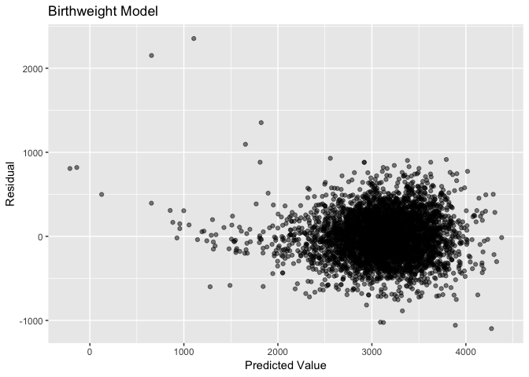

Homework 6
================
Melanie Mayer
11/19/2018

Probem 1
--------

Read in and clean data:

``` r
homicide_df = read_csv("https://raw.githubusercontent.com/washingtonpost/data-homicides/master/homicide-data.csv") %>%
  mutate(city_state = str_c(city, ", ", state),
         disposition = factor(disposition),
         victim_age = as.numeric(victim_age),
         resolved = ifelse(disposition == "Closed by arrest", 1, 0),
         resolved = factor(resolved),
         victim_race2 = ifelse(victim_race == "White", "white", "non-white"),
         victim_race2 = factor(victim_race2, levels = c("white", "non-white"))) %>%
  filter(!city_state %in% c("Dallas, TX", "Phoenix, AZ", "Kansas City, MO", "Tulsa, AL"))
```

    ## Warning in evalq(as.numeric(victim_age), <environment>): NAs introduced by
    ## coercion

``` r
#Homicide resolved defined as "Closed by arrest"
#Unsolved defined as "Closed without arrest" or "Open/No arrest"

#Check for missing data
homicide_df %>% 
  select_if(function(x) any(is.na(x))) %>% 
  summarise_each(funs(sum(is.na(.)))) %>%
  knitr::kable()
```

|  victim\_age|  lat|  lon|
|------------:|----:|----:|
|          515|   60|   60|

This data tells us about the criminal homicides since 2007 in 50 of the largest cities in the USA. For each homicide information is given on the victim's age, race, and sex. The location of the incident described by the city, state, and longitudinal/latitudinal point is specified. The outcome of the homicide, i.e. whether it resulted in an arrest, is also presented.

City-state variable, binary variable indicating whether the homicide is solved, and binary variable indicating whether the victim is white are created. Cities Dallas, TX; Phoenix, AZ; Kansas City, MO; and Tulsa, AL are ommited due to lack of data or data entry error. Age is coerced into numeric, NAs are created for unknown ages. These will be ommited in the upcoming model. The indicator variables come from variables which have no missing data, therefore they do not have any missing values.

Create a model for Baltimore:

``` r
baltimore_glm = homicide_df %>%
  filter(city_state == "Baltimore, MD") %>%
  glm(resolved ~ victim_age + victim_sex + victim_race2, data = ., family = binomial())

#Extract wanted information and display

baltimore_glm %>%
  broom::tidy() %>% 
  mutate(OR = exp(estimate),
         conf.low = exp(confint(baltimore_glm))[,1],
         conf.high = exp(confint(baltimore_glm)[,2])) %>%
  filter(term == "victim_race2non-white") %>%
  dplyr::select(term, OR, conf.low, conf.high) %>% 
  knitr::kable(digits = 3)
```

    ## Waiting for profiling to be done...
    ## Waiting for profiling to be done...

| term                   |     OR|  conf.low|  conf.high|
|:-----------------------|------:|---------:|----------:|
| victim\_race2non-white |  0.441|     0.312|       0.62|

Above we obtain the estimate and confidence interval of the adjusted odds ratio for solving homicides comparing non-white victims to white victims keeping all other variables fixed for the city of Baltimore, MD.

Create a model for all cities in data set:

``` r
#Map previously used model to all cities
#Clean and ouput wanted information

race_glm = homicide_df %>%
  dplyr::select(city_state, resolved, victim_age, victim_sex, victim_race2) %>%
  mutate(city_state = factor(city_state)) %>%
  nest(-city_state) %>%
  mutate(glm = map(.$data, ~glm(resolved ~ victim_age + victim_sex + victim_race2, data = .x, family = binomial())),
         confint = map(glm, confint),
         glm = map(glm, ~ broom::tidy(.x)),
         confint = map(confint, ~broom::tidy(.x))) %>%
  dplyr::select(-data) %>%
  unnest() %>%
  filter(term == "victim_race2non-white") %>%
  rename(conf.low = "X2.5..", conf.high = "X97.5..") %>%
  mutate(OR = exp(estimate),
         conf.low = exp(conf.low),
         conf.high = exp(conf.high)) %>%
  dplyr::select(city_state, OR, conf.low, conf.high)


#Plot our findings
race_glm %>%
  mutate(city_state = fct_reorder(city_state, OR)) %>%
  ggplot(aes(x = city_state, y = OR)) +
    geom_point() + 
    geom_errorbar(aes(ymin = conf.low, ymax = conf.high)) +
    theme(axis.text.x = element_text(angle = 90, hjust = 1)) +
    labs(x = "",
         y = "Odds Ratio",
         title = "Solved Homicides based on Victim's Race",
         caption = "Odds ratio compares non-whites to whites")
```


The graph demonstrates the adjusted odds ratio for solving homicides comparing non-white victims to white victims, keeping victim age and sex fixed. We see there is a lot of variation across cities, ranging from 0.115 in Boston, MA to 1.159 in Tampa, FL. Certain cities have much smaller confidence intervals than others as well. This may be a result of ranging sample sizes from different amounts of homicides occuring in each city, or from missing data.

Probem 2
--------

Read in and clean data:

``` r
birth_weight_df = read_csv("./birthweight.csv") %>%
  mutate(babysex = factor(babysex),
         frace = factor(frace),
         malform = factor(malform),
         mrace = factor(mrace)
         )

#Categorical variables factored
#Numerical variables as numeric

#Check for missing data
birth_weight_df %>% 
  select_if(function(x) any(is.na(x))) %>% 
  summarise_each(funs(sum(is.na(.)))) %>%
  knitr::kable()
```

``` r
#There are no NAs in the data frame
```

Create regression model for birthweight:

``` r
#Create a model with all variables
bwt_lm_step = lm(formula = bwt ~ ., data = birth_weight_df)

#Use an automatic stepwise process for variable selection
bwt_lm_step <- stepAIC(bwt_lm_step, direction = "both")
```

    ## Start:  AIC=48717.83
    ## bwt ~ babysex + bhead + blength + delwt + fincome + frace + gaweeks + 
    ##     malform + menarche + mheight + momage + mrace + parity + 
    ##     pnumlbw + pnumsga + ppbmi + ppwt + smoken + wtgain
    ## 
    ## 
    ## Step:  AIC=48717.83
    ## bwt ~ babysex + bhead + blength + delwt + fincome + frace + gaweeks + 
    ##     malform + menarche + mheight + momage + mrace + parity + 
    ##     pnumlbw + pnumsga + ppbmi + ppwt + smoken
    ## 
    ## 
    ## Step:  AIC=48717.83
    ## bwt ~ babysex + bhead + blength + delwt + fincome + frace + gaweeks + 
    ##     malform + menarche + mheight + momage + mrace + parity + 
    ##     pnumlbw + ppbmi + ppwt + smoken
    ## 
    ## 
    ## Step:  AIC=48717.83
    ## bwt ~ babysex + bhead + blength + delwt + fincome + frace + gaweeks + 
    ##     malform + menarche + mheight + momage + mrace + parity + 
    ##     ppbmi + ppwt + smoken
    ## 
    ##            Df Sum of Sq       RSS   AIC
    ## - frace     4    124365 320848704 48712
    ## - malform   1      1419 320725757 48716
    ## - ppbmi     1      6346 320730684 48716
    ## - momage    1     28661 320752999 48716
    ## - mheight   1     66886 320791224 48717
    ## - menarche  1    111679 320836018 48717
    ## - ppwt      1    131132 320855470 48718
    ## <none>                  320724338 48718
    ## - fincome   1    193454 320917792 48718
    ## - parity    1    413584 321137922 48721
    ## - mrace     3    868321 321592659 48724
    ## - babysex   1    853796 321578134 48727
    ## - gaweeks   1   4611823 325336161 48778
    ## - smoken    1   5076393 325800732 48784
    ## - delwt     1   8008891 328733230 48823
    ## - blength   1 102050296 422774634 49915
    ## - bhead     1 106535716 427260054 49961
    ## 
    ## Step:  AIC=48711.51
    ## bwt ~ babysex + bhead + blength + delwt + fincome + gaweeks + 
    ##     malform + menarche + mheight + momage + mrace + parity + 
    ##     ppbmi + ppwt + smoken
    ## 
    ##            Df Sum of Sq       RSS   AIC
    ## - malform   1      1447 320850151 48710
    ## - ppbmi     1      6975 320855679 48710
    ## - momage    1     28379 320877083 48710
    ## - mheight   1     69502 320918206 48710
    ## - menarche  1    115708 320964411 48711
    ## - ppwt      1    133961 320982665 48711
    ## <none>                  320848704 48712
    ## - fincome   1    194405 321043108 48712
    ## - parity    1    414687 321263390 48715
    ## + frace     4    124365 320724338 48718
    ## - babysex   1    852133 321700837 48721
    ## - gaweeks   1   4625208 325473911 48772
    ## - smoken    1   5036389 325885093 48777
    ## - delwt     1   8013099 328861802 48817
    ## - mrace     3  13540415 334389119 48885
    ## - blength   1 101995688 422844392 49908
    ## - bhead     1 106662962 427511666 49956
    ## 
    ## Step:  AIC=48709.53
    ## bwt ~ babysex + bhead + blength + delwt + fincome + gaweeks + 
    ##     menarche + mheight + momage + mrace + parity + ppbmi + ppwt + 
    ##     smoken
    ## 
    ##            Df Sum of Sq       RSS   AIC
    ## - ppbmi     1      6928 320857079 48708
    ## - momage    1     28660 320878811 48708
    ## - mheight   1     69320 320919470 48708
    ## - menarche  1    116027 320966177 48709
    ## - ppwt      1    133894 320984044 48709
    ## <none>                  320850151 48710
    ## - fincome   1    193784 321043934 48710
    ## + malform   1      1447 320848704 48712
    ## - parity    1    414482 321264633 48713
    ## + frace     4    124393 320725757 48716
    ## - babysex   1    851279 321701430 48719
    ## - gaweeks   1   4624003 325474154 48770
    ## - smoken    1   5035195 325885346 48775
    ## - delwt     1   8029079 328879230 48815
    ## - mrace     3  13553320 334403471 48883
    ## - blength   1 102009225 422859375 49906
    ## - bhead     1 106675331 427525481 49954
    ## 
    ## Step:  AIC=48707.63
    ## bwt ~ babysex + bhead + blength + delwt + fincome + gaweeks + 
    ##     menarche + mheight + momage + mrace + parity + ppwt + smoken
    ## 
    ##            Df Sum of Sq       RSS   AIC
    ## - momage    1     29211 320886290 48706
    ## - menarche  1    117635 320974714 48707
    ## <none>                  320857079 48708
    ## - fincome   1    195199 321052278 48708
    ## + ppbmi     1      6928 320850151 48710
    ## + malform   1      1400 320855679 48710
    ## - parity    1    412984 321270064 48711
    ## + frace     4    125020 320732060 48714
    ## - babysex   1    850020 321707099 48717
    ## - mheight   1   1078673 321935752 48720
    ## - ppwt      1   2934023 323791103 48745
    ## - gaweeks   1   4621504 325478583 48768
    ## - smoken    1   5039368 325896447 48773
    ## - delwt     1   8024939 328882018 48813
    ## - mrace     3  13551444 334408523 48881
    ## - blength   1 102018559 422875638 49904
    ## - bhead     1 106821342 427678421 49953
    ## 
    ## Step:  AIC=48706.02
    ## bwt ~ babysex + bhead + blength + delwt + fincome + gaweeks + 
    ##     menarche + mheight + mrace + parity + ppwt + smoken
    ## 
    ##            Df Sum of Sq       RSS   AIC
    ## - menarche  1    100121 320986412 48705
    ## <none>                  320886290 48706
    ## - fincome   1    240800 321127090 48707
    ## + momage    1     29211 320857079 48708
    ## + ppbmi     1      7479 320878811 48708
    ## + malform   1      1678 320884612 48708
    ## - parity    1    431433 321317724 48710
    ## + frace     4    124743 320761547 48712
    ## - babysex   1    841278 321727568 48715
    ## - mheight   1   1076739 321963029 48719
    ## - ppwt      1   2913653 323799943 48743
    ## - gaweeks   1   4676469 325562760 48767
    ## - smoken    1   5045104 325931394 48772
    ## - delwt     1   8000672 328886962 48811
    ## - mrace     3  14667730 335554021 48894
    ## - blength   1 101990556 422876847 49902
    ## - bhead     1 106864308 427750598 49952
    ## 
    ## Step:  AIC=48705.38
    ## bwt ~ babysex + bhead + blength + delwt + fincome + gaweeks + 
    ##     mheight + mrace + parity + ppwt + smoken
    ## 
    ##            Df Sum of Sq       RSS   AIC
    ## <none>                  320986412 48705
    ## + menarche  1    100121 320886290 48706
    ## - fincome   1    245637 321232048 48707
    ## + momage    1     11698 320974714 48707
    ## + ppbmi     1      8823 320977589 48707
    ## + malform   1      1884 320984528 48707
    ## - parity    1    422770 321409181 48709
    ## + frace     4    128726 320857686 48712
    ## - babysex   1    846134 321832545 48715
    ## - mheight   1   1012240 321998651 48717
    ## - ppwt      1   2907049 323893461 48743
    ## - gaweeks   1   4662501 325648912 48766
    ## - smoken    1   5073849 326060260 48771
    ## - delwt     1   8137459 329123871 48812
    ## - mrace     3  14683609 335670021 48894
    ## - blength   1 102191779 423178191 49903
    ## - bhead     1 106779754 427766166 49950

``` r
#Show results
bwt_lm_step %>%
  broom::glance()
```

    ## # A tibble: 1 x 11
    ##   r.squared adj.r.squared sigma statistic p.value    df  logLik    AIC
    ## *     <dbl>         <dbl> <dbl>     <dbl>   <dbl> <int>   <dbl>  <dbl>
    ## 1     0.718         0.717  272.      848.       0    14 -30500. 61029.
    ## # ... with 3 more variables: BIC <dbl>, deviance <dbl>, df.residual <int>

I used a data driven stepwise selection method to create a model to predict birthweight. This selected the variables which would minimize the AIC. This may be problematic because it may remove variables which we are interested in seeing the relationship with birthweight and it may include highly correlated covariates. For simply predictive purposes however this appears to do well, with an R squared of 0.718.

Diagnostic of previously created model:

``` r
birth_weight_df %>%
  modelr::add_predictions(bwt_lm_step) %>%
  modelr::add_residuals(bwt_lm_step) %>%
  ggplot(aes(x = pred, y = resid)) + 
  geom_point(alpha = 0.5) +
    labs(x = "Predicted Value",
         y = "Residual",
         title = "Birthweight Model")
```



The plot above shows us how well we satisfied the assumption of equal variance of the residuals as well as looks for outliers. There is a big data size, 4342, therefore seeing a trend is difficult. The residuals do seem to bounce around zero which is good since the expected value is zero. There does seem to be some values which stand out on the lower end however, we may want to look into these if we were to continue with this model.

Comparing models (CV):

``` r
set.seed(1)

#Create models to compare mine to 
bwt_lm_2 = lm(bwt ~ blength + gaweeks, data = birth_weight_df)
bwt_lm_3interact = lm(bwt ~ bhead*blength*babysex, data = birth_weight_df)

#Create training and testing data, cross validate
cv_df = 
  crossv_mc(birth_weight_df, 100) %>% 
  mutate(train = map(train, as_tibble),
         test = map(test, as_tibble)) %>% 
  mutate(my_mod       = map(train, ~lm(formula = bwt ~ babysex + bhead + blength + delwt + fincome + gaweeks + mheight + mrace + parity + ppwt + smoken, data = .x)),
         reg_mod      = map(train, ~lm(bwt ~ gaweeks + blength, data = .x)),
         interact_mod = map(train, ~lm(bwt ~ bhead*blength*babysex, data = .x))) %>% 
  mutate(rmse_my_mod       = map2_dbl(my_mod, test, ~rmse(model = .x, data = .y)),
         rmse_reg_mod      = map2_dbl(reg_mod, test, ~rmse(model = .x, data = .y)),
         rmse_interact_mod = map2_dbl(interact_mod, test, ~rmse(model = .x, data = .y)))
```

    ## Warning in predict.lm(model, data): prediction from a rank-deficient fit
    ## may be misleading

    ## Warning in predict.lm(model, data): prediction from a rank-deficient fit
    ## may be misleading

``` r
#Plot RMSE to compare models
cv_df %>% 
  dplyr::select(starts_with("rmse")) %>% 
  gather(key = model, value = rmse) %>% 
  mutate(model = str_replace(model, "rmse_", ""),
         model = fct_inorder(model)) %>% 
  ggplot(aes(x = model, y = rmse)) + geom_violin()
```


We are looking for the model which gives us the lowest root mean squared error (RMSE). We see the model only using length at birth and gestational age as predictors does not do a very good job with the testing data and therefore we would not count on it to have the best predictive ability of birthweight. My model does a little better than the interaction model. Mine, however, has a lot more variables which may be problematic while the interaction model can be very confusing to interpret. In practice I would use my model but try to cut down on variables if possible and look more into collinearity and the assumptions of a linear regression model, seeing how we may have some violations.
